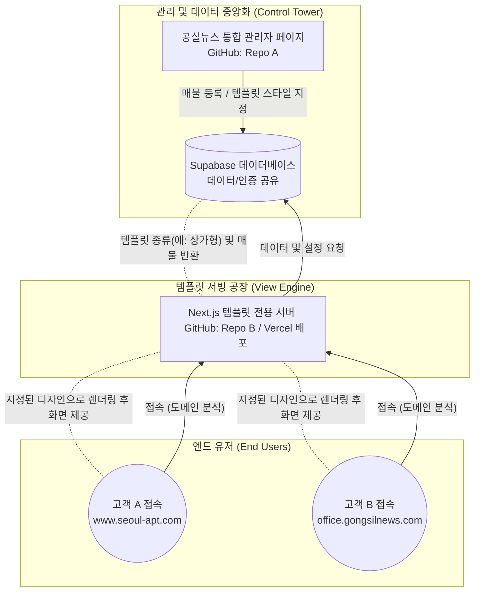

# 🏢 공실뉴스 멀티테넌트(SaaS) 템플릿 플랫폼 기획서

## 1. 프로젝트 개요
본 프로젝트는 기존 '공실뉴스' 플랫폼의 인프라를 확장하여, 개별 부동산 중개사들에게 **독립적이고 다양한 디자인의 맞춤형 부동산 홈페이지를 제공하는 "템플릿 기반 SaaS 플랫폼"**을 구축하는 것을 목표로 합니다.

## 2. 핵심 아키텍처 설계 (기능 및 코드 격리)
전체 시스템의 안정성과 무한한 확장성을 위해 기존 공실뉴스와 신규 템플릿 플랫폼의 코드를 철저하게 분리하는 마이크로서비스(Microservices) 형태를 취합니다.

## 3. 부문별 상세 역할

### 3.1. 관리자 페이지 (기존 공실뉴스)
*   **역할:** 데이터 입력 및 컨트롤 타워
*   **구현 모델:** 공실뉴스 사이트 내 어드민 페이지에 **[내 홈페이지 관리]** 메뉴 신설.
*   **주요 기능:**
    *   매물의 분산 노출 선택 (`공실뉴스 메인 노출` / `내 홈페이지 노출` 체크박스)
    *   템플릿 스타일 선택 (예: A형 아파트 전문, B형 상가/사무실 전문 등)
    *   개인 로고, 인사말, 배너 이미지 등록
    *   **개별 게시판 모듈 제어:** 무제한 자유 생성 방식이 아닌, 템플릿에 최적화된 지정형 게시판(예: 공지사항, 매물후기, 1:1 고객문의 등)의 On/Off 토글 지원으로 시스템 안정성과 사용성을 극대화합니다.

### 3.2. 데이터베이스 (Supabase 공유)
*   **역할:** 시스템의 유일한 두뇌. 데이터 싱글 소스 오브 트루스(SSOT).
*   공실뉴스와 새로운 템플릿 서버가 완벽하게 **동일한 주소와 API 키를 공유**하여 접속합니다. 데이터 중복 입력을 원천 차단합니다.
*   **멀티테넌시(Multi-Tenancy) 게시판/데이터 격리:** 하나의 데이터베이스(DB)를 공유하되, 모든 게시글과 매물 테이블에 `agent_id` 컬럼을 명시하여 각 중개사별 전용 게시판과 데이터들이 논리적으로 완벽히 격리되도록 설계합니다.
*   **속도 최적화 (인덱싱):** 누적 데이터가 수백만 건 이상 방대해져도 성능 저하가 없도록, `agent_id` 및 분류 속성값에 철저하게 DB 인덱스(Index)를 적용하여 자기 자신의 데이터만 즉각적으로 로드할 수 있도록 보장합니다.

### 3.3. 프론트엔드 (본 프로젝트: 바탕화면 `homepage` 폴더)
*   **역할:** 철저하게 사용자에게 화면을 보여주는(View) 쇼룸 역할만 전담. (로그인, 관리자 기능 없음)
*   **기술 스택:** Next.js (App Router), Tailwind CSS
*   **작동 로직:** 코딩 내부에 `TemplateA_Apartment`, `TemplateB_Office` 와 같은 다수의 UI 레이아웃 폴더를 보유하고, 접속자의 URL에 따라 해당하는 컴포넌트를 즉시 조립하여 반환(서버 사이드 렌더링)합니다.

## 4. 도메인 및 호스팅 배포 전략 (Vercel)
글로벌 플랫폼(Shopify 등)이 사용하는 **초개인화 도메인 마스킹(도메인 유지)** 기술을 적용합니다.

1.  **Vercel 배포 분리:** 기존 공실뉴스와 완전히 독립된 신규 Vercel 프로젝트로 템플릿 레포지토리 배포.
2.  **Next.js Middleware 적용:** 사용자 접속 시 입력된 도메인(`req.headers.host`)을 실시간으로 가로채어 DB에 등록된 에이전트의 템플릿을 식별.
3.  **자유로운 도메인 연결 설정:**
    *   기본 제공: 서브도메인 (예: `agent1.gongsilnews.com`)
    *   프리미엄 옵션: 중개사 개인 커스텀 도메인 완벽 지원 (예: `www.agent1.com` 접속 시 주소 변경 없이 Vercel 내부에서 라우팅 처리 - Platforms API 활용)

## 5. 기대 효과 및 비즈니스 가치
*   **시스템 안정성:** 템플릿 플랫폼 고도화 작업 중 스크립트 에러가 생겨도 부하 확장이 격리되어 있어 기존 공실뉴스 운영에 전혀 피해를 주지 않음.
*   **유지보수 효율 압도적 향상:** 수백 개의 템플릿 사이트가 단일 소스코드(`homepage` 레포지토리) 위에서 돌아가므로, 기능 하나만 패치해도 모든 고객의 홈페이지가 일 일괄 업그레이드됨.
*   **신규 비즈니스 모델 구축:** "매물 관리 시스템 + 무료 홈페이지" 제공을 필두로, 프리미엄 템플릿이나 커스텀 도메인 연결을 빌미로 정기 구독(SaaS) 비즈니스 수익 창출 가능.

## 6. SaaS 연동 API 비용 방어 및 스케일링(Scaling) 전략
전국 단위의 중개사들이 각자의 지도(사무실 위치 등) 기능을 템플릿에서 사용할 때, 플랫폼 본사(공실뉴스)에 API 호출 요금 폭탄이 발생하는 리스크를 원천 차단하기 위해 다음의 2-Track 전략을 도입합니다.

*   **기본 옵션 (Static Map 캐싱 최적화):** 동적인 지도 스크립트 대신, 중개사가 주소를 등록할 때 단 한 번만 **지도 캡처 이미지(Static Map)**를 생성하여 스토리지에 저장합니다. 접속자가 아무리 많아도 API 호출량은 0건으로 유지되며 완벽한 비용 방어가 가능합니다. (상세 보기는 지도 외부 링크로 연결)
*   **프리미엄 옵션 (BYOK - Bring Your Own Key):** 홈페이지 내에서 움직이는 다이나믹 지도를 꼭 띄우고 싶은 중개사에게는, 관리자 설정에서 **본인 명의의 지도 API Key(카카오/네이버 등)**를 직접 발급받아 입력하도록 권한을 줍니다. 이를 통해 트래픽 비용 및 과금 책임을 본사가 아닌 개별 중개사 계정으로 완벽히 분산시킵니다.
